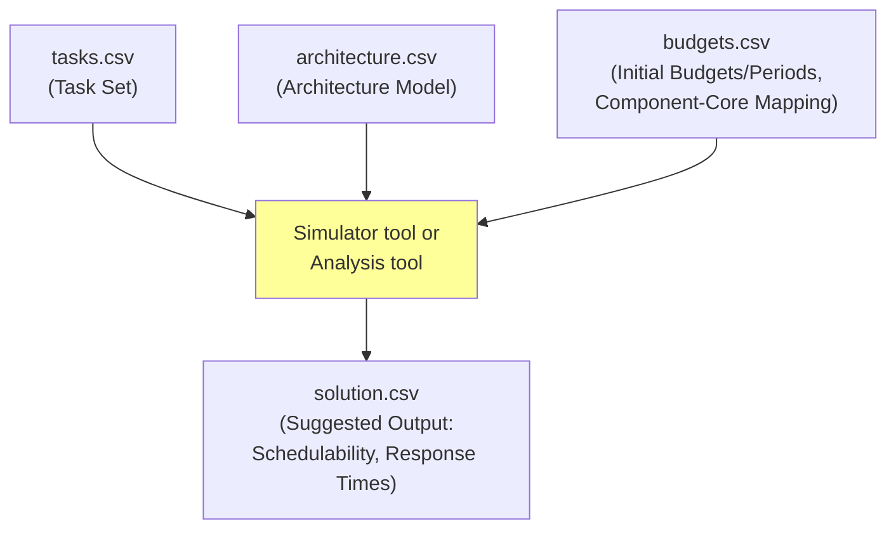

# 02225 Project Test Cases

This folder contains test cases in a CSV format that define test cases for the 02225 DRTS project. These files specify the task set, architecture model, and initial component budgets/periods for a hierarchical scheduling system.  

## Files

*   **`tasks.csv`:**  Defines the task set, including task parameters and component assignments.
*   **`architecture.csv`:** Defines the hardware platform (cores and their speeds).
*   **`budgets.csv`:** Defines the initial budget and period for each component, along with the component-to-core mapping.
*   **`solution.csv`:** *Suggested* output file format for reporting results. [in progress]

## Input and Output Flow Diagram



## `tasks.csv` - Task Set

This file describes the individual tasks within the system.

**Columns:**

*   **`task_name`:**  The name of the task (string).
*   **`wcet`:** The Worst-Case Execution Time (WCET) of the task in time units, assuming a nominal core speed (speed\_factor = 1.0) (float).
*   **`period`:** The period of the task in time units (float).
*   **`component_id`:**  The ID of the component to which the task is assigned (string).  
*   **`priority`:**  The priority of the task (integer).  This column is *only* relevant for tasks within components that use RM scheduling.  For EDF components, this column will be empty. Priorities are assigned based on the Rate Monotonic (RM) principle (shorter period = higher priority).

## `architecture.csv` - Architecture Model

This file describes the hardware platform, specifically the cores and their relative speeds.

**Columns:**

*   **`core_id`:**  A unique identifier for the core (string).
*   **`speed_factor`:**  A numerical value representing the core's speed relative to a nominal speed.  `1.0` represents the nominal speed.  A value of `0.5` indicates a core that is 50% slower, and a value of `1.2` indicates a core that is 20% faster.  The WCET of tasks assigned to a core must be adjusted by dividing the nominal WCET by the `speed_factor`.
*   **`scheduler`:** Top level scheduler for this core, `RM` or `EDF`. This scheduler will schedule Components within the core.

## `budgets.csv` - Initial Budgets, Periods, and Component-Core Mapping

This file provides the initial budget and period for each component, derived from PRM interface parameters (Theta, Pi). It also shows which core the component is assigned to.

**Columns:**

*   **`component_id`:** The ID of the component (string).  This matches the `component_id` used in `tasks.csv`.
*   **`scheduler`:** The scheduling algorithm used for the component (either `EDF` or `RM`) (string). This scheduler will schedule Tasks within the component.
*   **`budget`:**  The initial budget (Q) for the component, in time units (float). This value represents the resource allocation for each component.
*   **`period`:** The initial period (P) for the component, in time units (float).
*    **`core_id`:**  The ID of the core to which the component is assigned (string). This corresponds to the `core_id` in `architecture.csv`.
*   **`priority`:** The priority of the component (integer). This column is *only* relevant for components within cores that use RM scheduling as the top level scheduler.  For EDF cores, this column will be empty. Priorities are assigned based on the Rate Monotonic (RM) principle (shorter period = higher priority).

**Important Notes:**

*   **Initial Values:** The budget and period values are *initial* values derived from a PRM-based analysis. Students are expected to treat these as starting points and may need to further optimize them. They are also expected to perform BDR based analysis.

## Suggested Output Format

This file is a *suggestion* for how students might report the results of their simulator and analysis tool.  Students are free to modify the input and output formats as they see fit for their project.

**Suggested Columns:**

*   **`task_name`:** The name of the task (string).
*   **`component_id`:** The ID of the component the task belongs to (string).
*   **`task_schedulable`:**  A boolean value (0 or 1, or "TRUE"/"FALSE") indicating whether the task is schedulable according to the analysis tool (and simulator).
*   **`avg_response_time`:** The average response time of the task, as observed by the simulator (float).
*   **`max_response_time`:** The maximum response time of the task, as observed by the simulator (float).
* **`component_schedulable`** A boolean value indicating if *all* tasks within the component were schedulable.

**Note:**  The `avg_response_time` and `max_response_time` are typically outputs of the *simulator*, not the analysis tool.  The analysis tool usually focuses on *schedulability* (whether deadlines are met), not precise response times.  The analysis tool *could* potentially compute Worst-Case Response Times (WCRT), but that's an optional extension in the project description.

**Additional Output (Optional):**

Students might also consider including other information in their output, such as:

*   **Calculated BDR parameters (alpha, delta) for each component.**
*   **Core utilization.**
*    **Number of preemptions.**
*   **Other relevant metrics.**

**Flexibility:**

It is important to emphasize that both the input CSV formats and the suggested output format are *flexible*.  Students can add columns, modify the structure, or use different file formats altogether, as long as their choices are clearly documented and justified in their project report.  The key is that their tools should be able to read their chosen input format and produce meaningful output that allows them to analyze the system's behavior.


**`solution.csv` (Just an example; response times are placeholders):**

```csv
task_name,component_id,task_schedulable,avg_response_time,max_response_time,component_schedulable
Task_1,Component_1,1,0.0,0.0,1
Task_2,Component_1,1,0.0,0.0,1
Task_3,Component_1,1,0.0,0.0,1
Task_4,Component_2,1,0.0,0.0,1
Task_5,Component_2,1,0.0,0.0,1
Task_6,Component_2,1,0.0,0.0,1
Task_7,Component_3,1,0.0,0.0,1
Task_8,Component_3,1,0.0,0.0,1
Task_9,Component_3,1,0.0,0.0,1
Task_10,Component_3,1,0.0,0.0,1
```
